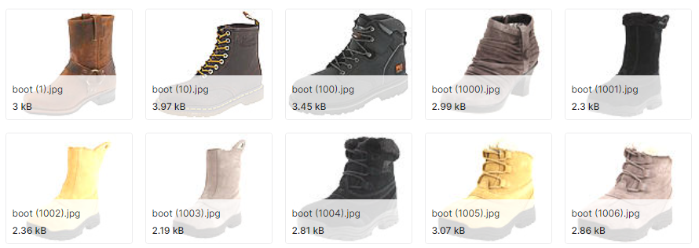

# Training a Diffusion Model on a Custom Dataset

This repo explores an exercise in the [Hugging Face Diffusion Models course](https://github.com/huggingface/diffusion-models-class/tree/main/unit1).

We’ll adapt the process from the Hugging Face Diffusion Models course notebook, 01_introduction_to_diffusers.ipynb, to train a diffusion model on our own dataset instead of one provided by Hugging Face. This demonstrates how the process can be generalized to work with different datasets.


## Setting up the Dataset

The dataset I've chosen is called [Shoe vs Sandal vs Boot](https://www.kaggle.com/datasets/hasibalmuzdadid/shoe-vs-sandal-vs-boot-dataset-15k-images). It was uploaded for classification problems and contains 15,000 images, 5,000 of each type.

<figure>
  
  <figcaption align="center">A few of the images in the dataset</figcaption>
</figure>

To create a custom `Dataset` class in PyTorch, we subclass `Dataset` and implement `__init__`, `__len__`, and `__getitem__`.

### `__init__`

`__init__` runs once. It will define the transforms we're applying to our dataset and initialize the directory containing our data.

Our file organization includes subfolders named **Boot**, **Shoe**, and **Sandal**. We'll use `img_labels` to traverse the directory in `__getitem__` as well as to label the data. We also count the size of our training data for the `__len__` function.

```python
class BootSandalShoeDataset(Dataset):
    def __init__(self, annotations_file, img_dir, transform=None, target_transform=None):
        self.img_dir = img_dir
        self.transform = transform
        self.target_transform = target_transform
        self.img_labels = ['Boot', 'Sandal', 'Shoe']
        self.length = 0
        # Count how many images we have.
        for label in self.img_labels:
            self.length += len(os.listdir(os.path.join(img_dir, label)))
```

### `__getitem__`
`__getitem__` finds the image on disk, applies the transformations, and returns the corresponding label and tensor. We need to find the correct path for every index. In our case, 1 maps to img_dir/Boot/boot (1).jpg and so on.

```python
def __getitem__(self, idx):
    # Since we know there's 15,000 items we will
    # map 0-4999 to be Boots, 5000-9999 Sandals, and 10000-14999 Shoes
    label = self.img_labels[idx // 5000]
    index = (idx % 5000) + 1
    img_path = os.path.join(self.img_dir, label, "{} ({}).jpg".format(label, index))
    image = read_image(img_path)
    if self.transform:
        image = self.transform(image)
    if self.target_transform:
        label = self.target_transform(label)
    return image, label
```

### `__len__`
For `__len__`, we return self.length that we defined in our `__init__` earlier.

## That's all!

Now that we have defined our custom dataset, we can feed it into the model defined in the Diffusion Models Course. After training, we have a diffuser capable of generating shoes based off our dataset.

Here are some shoes generated by the model after training.
<div align="center" style="display: flex; flex-wrap: wrap; gap: 16px; justify-content: center; margin: 56px 0;">
  
  
  
  
  
  
  
  
  
</div>

### Note

\* You might notice the backgrounds look tinted. The loss function used, Mean Squared Error, punishes extremes and pushes the colors towards the average.